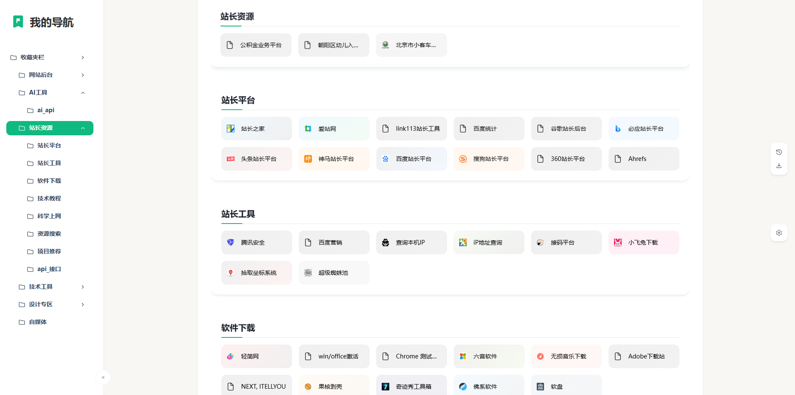

# TabMark-你的书签,值得被重新看见

> ## 二开说明
> #### 在原有的项目上增加了搜索引擎接口
> #### 将文件夹切换模式修改为了平铺全部展开，通过导航快速定位的模式
> #### 因为在本地使用，为了清爽，删除了设置中“关于”，“赞赏”的入口，有想要赞赏原作者的，可通过页面底部赞赏码或者到原作者项目页进行赞赏
> #### 最后，非常感谢大佬的开源

## 以下为项目原说明

## 项目网站: www.ainewtab.app

TabMark 将收藏夹变成新标签页，让你收藏的书签一目了然、整洁高效，快速直达你最需要的网站和资源。搭配智能 AI 搜索，更快找到你想要的答案。支持 Chrome 和 Edge。

## 请注意由于chrome 商店新的条款要求，拓展不允许同时修改新标签页和搜索功能，故chrome 商店版本暂时无法更新

- chrome 商店版本：1.243（实际为 1.241 版本，为 1.242 版本回滚）
- Edge版本：1.245 审核中
- GitHub 版本：1.245

## 主要功能

**将书签设置为新标签页**：安装拓展后，可以选择常用的书签文件夹。右键点击，选择"将书签设为主页"，即可在新标签页中快速打开选中路径书签文件夹。支持书签拖拽排序，侧边栏树状文件夹视图让你直观管理书签文件夹，快速找到所需内容；

**丰富的书签上下文菜单**：支持复制书签url、生成二维码、一键打开书签文件夹内所有书签；

**侧边栏书签**：在任意网页按下 Alt/Command + B，即可打开浏览器侧边栏，快速访问书签和搜索功能。

**悬浮球功能**：在任意网页右上方点击悬浮球，显示搜索快捷链接和默认设置的书签，助力高速浏览网页；

**AI智能搜索**：在新标签页直接使用 AI 搜索，快速访问豆包、Kimi、秘塔、felo、ChatGPT 等，还支持 Google、Bing 等经典搜索引擎；支持书签、历史记录的搜索；

**对比搜索**：在新标签页搜索框按下Cmd/Ctrl + Enter可以一键在所有搜索引擎中搜索搜索引擎中查找同一内容，对比不同结果，助你找到最佳答案；在任意网页选中文字后通过点击侧边栏或快捷键（Alt + 1-7 打开对应搜索，Cmd/Ctrl + Enter 打开全部搜索）高效启动搜索；

**自定义新标签页**：支持暗黑模式和壁纸随心换：提供 10 张精选预设壁纸，支持本地上传，个性化新标签页；

**浏览器功能快捷方式**：展示浏览器历史记录、下载、密码管理、拓展管理的快捷链接；

### 使用教程
https://cooing-loganberry-b74.notion.site/TabMark-Bookmark-New-Tab-7a083a74f84e4bb48345e389c1e53717

### 反馈建议

**微信交流群**

**赞赏码**

如果你觉得这个项目对你有帮助，可以请我喝杯咖啡~

邮箱：hello@ainewtab.app
